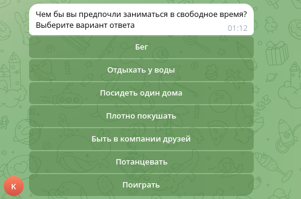

# Telegram Zoo Bot (Python)
Телеграм бот для проведения зоо викторины

## Скриншоты
### Приветственное сообщение

### Прохождение викторины

### Конец викторины

## Возможности
- Проведение викторины
- Полная настройка викторины под любую тему
- Рассылка сообщений с результатом викторины на email
- Отправка email сообщений с обратной связью от пользователя
- Отправка результата викторины себе на стену Вконтакте

## Стэк
 - Python
 - pyTelegramBotAPI
 - Dotenv

## Запуск
Для настройки бота нужно добавить в .env файл следующие переменные

TOKEN		    - Токен бота
SMTP_USERNAME	    - адресс smtp приложения
SMTP_PASSWORD	    - пароль smtp приложения
CONTACTS	    - email адреса через запятую для контактов с зоопарком
FEEDBACK_CONTACTS   - email адрес для получения обратной связи

Все настройки можно изменять в файле quiz_settings.py.
По умолчанию настройки smtp сервера указаны для Яндекс почты.
Количество вопросов викторины с ответами и животных можно менять как угодно.
Бот запускается командой python main.py в директории проекта.

## Планы
 - Добавление запуска через Docker